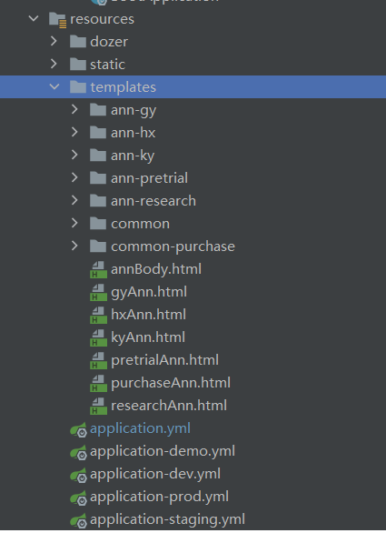

## FreeMarker + Vue + Element-UI的页面服务端渲染

#### ☕ 需求背景
- 当前在做的项目是基于`Vue2.x` 全家桶 + `Element-UI`组件库的一个 `Web` 应用, 最近客户提出需要在百度搜索的时候能够找到网站的内容. 由于`是单页面应用`的项目,需要有些公告页面做成服务器端渲染,以确保百度能够爬到数据.

#### ☕ 解决的痛点
- 如果用`Nuxt`或者`Vue-SSR`改造项目, 所需要的时间成本太大,而且对于已经在运行的项目而言,风险太高.
- 如果用传统的HTML来写,有些样式不能和现有项目的其他页面保持一致, 而且对于其他同事而言, 可维护性太低
- 所以经过探索, 决定在后端引入 `vue` 和 `element-ui`, `axios` 等所需要的一些包, 在后端无差别的开发服务器渲染的页面.

#### ☕ 前提
- <font color="#ff0000" size="3">已经有相应的接口读取了这个模板,并且注入了相应的接口数据</font>
- <font color="#00ff00" size="3">已经有相应的接口读取了这个模板,并且注入了相应的接口数据</font>
- <font color="yellow" size="3">已经有相应的接口读取了这个模板,并且注入了相应的接口数据</font>

#### ☕ 代码结构


- 业务模板在 `templates`文件夹下的`hxAnn.html`


#### ☕ 具体实现: 引入样式和脚本
- 使用CDN的方式引入 `vue` 的 `package`
- 使用CDN的方式引入 `element-ui` 的 `js package`
- 使用CDN的方式引入 `element-ui` 的 `theme package`
- 使用CDN的方式引入 `axios` 的 `package`
- 引入 `static/iconfont` 文件下的字体文件  `iconfont.css`
- 引入 `static/styles` 文件下的样式文件  `style.css`
- 引入 `static/utils` 文件下的工具方法文件  `utils.js`


#### ☕ 主体文件代码
```html
<!DOCTYPE html>
<html>

<head>
    <meta charset="UTF-8" />
    <!-- import CSS -->
    <link rel="stylesheet" href="../../static/css/annstyle.css">
    <link rel="stylesheet" href="../../static/iconfont/iconfont.css">
    <link href="https://cdn.bootcdn.net/ajax/libs/element-ui/2.14.0/theme-chalk/index.css" rel="stylesheet" />
    <title>${annTitle}</title>
    <link rel="bookmark" type="image/x-icon" href="../../static/img/favicon.ico" />
    <link rel="shortcut icon" href="../../static/img/favicon.ico">
    <link rel="icon" href="../../static/img/favicon.ico">
    <style>
        .el-form-item {
            margin-bottom: 0px;
        }

        .el-form-item__label {
            color: #939393;
        }

        .el-card__header {
            padding: 10px 20px;
        }

        .el-table th{
            background:  #f2f6fc;
        }
    </style>
</head>

<body>
<div id="app" v-loading="loading" element-loading-text="公告信息加载中..." element-loading-spinner="el-icon-loading"
     element-loading-background="rgba(0, 0, 0, 0.8)">
    <el-backtop>
        <i class="el-icon-caret-top"></i>
    </el-backtop>
    <el-row>
        <el-col :span="20" :offset="2">
            <!-- >>>> header start -->
            <#include "./common/header.html" />
            <!-- >>>> banner start -->
            <#include "./common/banner.html" />
            <!-- >>>> content -->
            <div>
                <!-- sub-content title -->
                <#include "./common-purchase/ann-title.html" />
                <!-- sub-content 状态 -->
                <#include "./common-purchase/ann-status.html" />
                <!-- sub-content 采购需求 -->
                <#include "./ann-hx/ann-content.html" />
                <!-- sub-content 采购清单 -->
                <#include "./ann-hx/ann-list.html" />
                <!-- sub-content  隐藏公告信息 -->
                <#include "./common-purchase/ann-hide.html" />
                <!-- sub-content 采购单位 -->
                <#include "./common-purchase/ann-hospital.html" />
                <!-- sub-content  其他公告 -->
                <#include "./common-purchase/ann-other.html" />
            </div>
        </el-col>
        <!-- >>>> footer start -->
        <#include "./common/footer.html" />
    </el-row>
</div>
</body>
<!-- import Vue before Element -->
<script src="https://cdn.bootcdn.net/ajax/libs/vue/2.5.2/vue.js"></script>
<!-- import JavaScript -->
<script src="https://cdn.bootcdn.net/ajax/libs/element-ui/2.14.0/index.js"></script>
<script src="https://cdn.bootcdn.net/ajax/libs/axios/0.18.0/axios.js"></script>
<script src="../../static/utils/index.js"></script>
<script>
    Vue.use(ELEMENT)
    new Vue({
        el: "#app",
        data() {
            return {
                // ------ vue fields
                loading: false,
                bidLoading: false,
                timeLeft: 0,
                intervalBundle: '',
                payWay: ['货到付款', '先付定金到货后再付款', '货到后7个工作日内付款'],
                invoices: ['增值税普通发票', '增值税专用发票', '不需要发票'],
                originsMapping: ['不限', '不限', '国产', '进口'],
                enterprise: getStore('Enterprise'),
                headerName: '',
                // ------ help fields
                h_endDate: '',
                h_currentDate: '',
                h_hasAttachments: false,
                h_annShowDealMoneyFlag: false,
                h_annShowDealMoneyValue: '',
                h_annOtherFlag: false,
                h_annCanShow: false,
                h_tradeModel: '',
                h_annType: '',
                h_templateCode: '',
                h_sumBadding: 0,
                // ------ util
                dateWithoutSec: dateWithoutSec,
                toRMB: toRMB
            };
        },
        async mounted() {
            this.loading = true
            setTimeout(() => {
                this.loading = false
            }, 1000);
            //初始化剩余秒数
            await this.initSecondsLeft();
            // 绑定倒计时事件
            this.intervalBundle = setInterval(this.timeCountDown, 1000);
        },
        created() {
            this.h_endDate = '${annExpiredDate}'
            this.h_currentDate = '${annCurrentDate}'
            this.h_hasAttachments = '${annAttachmentFlag}' == 2
            this.h_annShowDealMoneyFlag = '${annShowDealMoneyFlag?c}'
            this.h_annShowDealMoneyValue = '${annShowDealMoneyValue}'
            this.h_annOtherFlag = '${annHasOtherAnnFlag}' == 2
            this.h_annCanShow = '${annCanShow}' != 1
            this.h_templateCode = '${templateCode}'
            this.h_tradeModel = '${annTradeModel}' == 5
            this.h_annType = '${annType}'
            this.h_sumBadding = '${sumBadding}'

            // 获取header name
            this.headerName = this.getHeaderName()
        },
        methods: {
            getHeaderName(){
                const hospital = getStore('CurrentUser') || {}
                const supplier = getStore('Enterprise') || {}
                let enterprise = Object.assign(hospital, supplier)
                if (enterprise) {
                    // 采购商|医院方
                    if (enterprise.userType == 1) {
                        // 区分管理员和普通账号
                        return enterprise.pid == -1
                            ? enterprise.hospitalName +
                            ' - 系统管理员 - ' +
                            enterprise.userName
                            : enterprise.hospitalName +
                            ' - ' +
                            enterprise.deptName +
                            ' - ' +
                            enterprise.staffName
                    } else if (enterprise.userType == 2) {
                        // 供应商
                        return enterprise.supplierName
                    }
                }
            },
            //和当前日期比较,计算剩余多少秒
            initSecondsLeft() {
                const ary_curtDate = this.h_currentDate.split(/[- : /]/);
                const ary_endDate = this.h_endDate.split(/[- : /]/);
                const toCurDate = new Date(ary_curtDate[0], ary_curtDate[1] - 1, ary_curtDate[2], ary_curtDate[3], ary_curtDate[4], ary_curtDate[5]);
                const toEndDate = new Date(ary_endDate[0], ary_endDate[1] - 1, ary_endDate[2], ary_endDate[3], ary_endDate[4], ary_endDate[5]);
                //参数日期 > 当前日期 => 获取剩余秒数
                if (toEndDate > toCurDate) {
                    this.timeLeft = Math.floor((toEndDate.getTime() - toCurDate.getTime()) / 1000);
                } else {
                    this.timeLeft = 0;
                }
            },
            //间隔事件: 剩余秒数--, 当剩余秒数为0时,清除间隔事件.
            timeCountDown() {
                if (this.timeLeft > 0) {
                    this.timeLeft--;
                } else {
                    clearInterval(this.intervalBundle);
                }
            },
            toAnnDetail() {
                let ids = []
                for (let index in arguments) {
                    ids.push(arguments[index])
                }
                ids = ids.join('')
                window.open(getAppDomainOrigin() + '/epro/announcement/detail/' + ids, '_self')
            },
            // 报价事件初始化
            handleInitBid() {
                // 判断是否登录
                if (this.enterprise && this.enterprise.id) {
                    const params = {
                        projectId: '${projectId}',
                        annId: '${annId}'
                    }
                    this.biddingHandler(params)
                } else {
                    this.handleToLogin()
                }
            },
            // 报价事件执行者
            async biddingHandler(params) {
                // 获取axios实例
                const axiosInstance = getAxiosInstance()
                // step 1: 是否拉黑
                const blackParams = {
                    enterpriseId: this.enterprise.id,
                    annId: params.annId
                }
                this.bidLoading = true
                const black_result = await axiosInstance.get('/api/bidding/isSupplierInBlackList' + formatParams(blackParams))
                // >>>>>> 被拉黑
                if (black_result.data.result) {
                    this.$alert('因贵公司被采购方投诉,已被禁止参与报价!', '提示', {
                        confirmButtonText: '确定',
                        type: 'warning',
                        callback: (action) => {
                            this.bidLoading = false
                        },
                    })
                }
                // >>>>>> 未被拉黑
                else {
                    const quoted_price_path = ''
                    // >>>>>> 获取供应商认证状态
                    const checkParams = {
                        baseId: params.projectId
                    }
                    const check_data = await axiosInstance.get('/api/bidding/supperlierProCheck' + formatParams(checkParams))
                    if (check_data.data.status === 1) {
                        const check_result = check_data.data.result
                        // 医院对供应商报价要求 1:医院认证的供应商 2:平台认证的供应商 3:无需求
                        const needAuth = check_result.needAuthentication
                        //  医院对供应商的审核状态【1:审核中；2审核通过；3:拉黑; 4: 拒绝】
                        const hospitalStatus = check_result.hospitalStatus
                        // 状态 1:信息不完整(非会员) 2:待审核，3:信息完整,审核通过(会员), 4:审核不通过，5:禁用，6:删除
                        const platStatus = check_result.platStatus
                        // 是否存在未支付的服务单 【false:不存在 | true: 存在】
                        const existUnpaidServiceFee = check_result.existUnpaidServiceFee
                        // 0-没有未支付的 1-有未支付的但还可以继续报价 2-有未支付的不能继续报价了
                        // const unpaidServiceFeeCount = check_result.unpaidServiceFeeCount
                        const hospitalId = check_result.hospitalId
                        const supplierId = check_result.supplierId
                        // ################### 存在未支付的情况 ###################
                        if (existUnpaidServiceFee) {
                            const queryCheck = {
                                baseId: params.projectId,
                                annId: params.annId,
                                hospitalId: hospitalId,
                                supplierId: hospitalId,
                            }
                            this.handleToQuotedCheck(queryCheck)
                        } else {
                            // ################### 无要求 ###################
                            if (needAuth == 3) {
                                if (platStatus != 1) {
                                    // 信息不完整
                                    this.handleToQuotedPrice(params)
                                } else {
                                    // 信息提交过
                                    this.handleToSupplierCenter()
                                }
                            }
                            // ################### 平台认证的供应商 ###################
                            else if (needAuth == 2) {
                                if (platStatus == 1) {
                                    // >>>>>>>>> 未实名认证 >>>>>>>>>
                                    this.handleToSupplierCenter()
                                } else if (platStatus == 2 || platStatus == 4) {
                                    // >>>>>>>>> 待审和驳回状态 >>>>>>>>>
                                    const bidParams = {
                                        demandId: params.projectId
                                    }
                                    const checkBid_data = await axiosInstance.get('/api/bidding/demandDetail' + formatParams(bidParams))
                                    if (checkBid_data.data.result.dealFlag) {
                                        // 已经报过名的 - 报价页面
                                        this.handleToQuotedPrice(params)
                                    } else {
                                        // 未报过名的 - check 页面
                                        const queryCheck = {
                                            baseId: params.projectId,
                                            annId: params.annId,
                                            hospitalId: hospitalId,
                                            supplierId: hospitalId,
                                        }
                                        this.handleToQuotedCheck(queryCheck)
                                    }
                                } else if (platStatus == 3) {
                                    // >>>>>>>>>>>>>>>>>> 通过 >>>>>>>>>>>>>>>>>>
                                    this.handleToQuotedPrice(params)
                                }
                            }
                            // ###################  医院认证的供应商 ###################
                            else if (needAuth == 1) {
                                if (platStatus != 1) {
                                    // 查看是否报过价
                                    const verifyParams = {
                                        demandId: params.projectId
                                    }
                                    const verify_data = await axiosInstance.get('/api/bidding/demandDetail' + formatParams(verifyParams))
                                    if (verify_data.data.result.dealFlag) {
                                        // 已经报过价的 - 报价页面
                                        this.handleToQuotedPrice(params)
                                    } else {
                                        // 未报过价 & 未建立关系的 - check 页面
                                        if (hospitalStatus !== 2) {
                                            const queryCheck = {
                                                baseId: params.projectId,
                                                annId: params.annId,
                                                hospitalId: hospitalId,
                                                supplierId: hospitalId,
                                            }
                                            this.handleToQuotedCheck(queryCheck)
                                        } else {
                                            // 未报过价-已经建立关系的.
                                            this.handleToQuotedPrice(params)
                                        }
                                    }
                                } else {
                                    // 未实名认证
                                    this.handleToSupplierCenter()
                                }
                            }
                        }
                    } else {
                        this.bidLoading = false
                        this.$message.error(check_data.data.msg)
                        if (check_data.data.code == '1001') {
                            this.handleToLogin()
                        }
                    }
                }
            },
            // 前往报价页面
            handleToQuotedPrice(params) {
                window.open(getAppDomainHash() + '/quoted/indexPrice/' + params.projectId + '/' + params.annId, '_self')
            },
            // 前往报价校验页面
            handleToQuotedCheck(queryCheck) {
                window.open(getAppDomainHash() + '/quoted/check' + formatParams(queryCheck), '_self')
            },
            // 前往登录页
            handleToLogin() {
                window.open(getAppDomainHash() + '/login', '_self')
            },
            // 前往实名认证页面
            handleToSupplierCenter() {
                this.$message.warning('报价前需要先完成实名认证!')
                window.open(getAppDomainHash() + '/supplierAutonym', '_self')
            }
        },
        computed: {
            // 获取倒计时结果和状态
            timeLeftObject() {
                return isExpired(this.timeLeft)
            },
            // 附件下载链接
            downloadUrl() {
                return getAppDomainOrigin() + '/epro/api/announcement/download/attachment?announcementId=${annId}&nowT=' + new Date().getTime()
            },
            // time style
            timeStyle() {
                return this.timeLeftObject.text.indexOf('天') > -1 ? '#333333' : '#ff0000'
            },
            // show button
            showButton() {
                const localUser = getStore('CurrentUser') || {}
                if (localUser['userType']) {
                    return localUser['userType'] == 2
                } else {
                    return true
                }
            },
            // can show text
            hideMsg() {
                const typeMap = { 3: '已完成', 4: '已废标' }
                return '该采购项目' + (typeMap['${annType}'] || '') + '详细情况请与医院联系!'
            }
        },
        beforeDestroy() {
            // 销毁倒计时事件
            clearInterval(this.intervalBundle);
        }
    });
</script>

</html>
```


#### ☕ 具体实现: 抽象公共模板和业务公共模板
- 有多个页面有相同的布局, 分别提取模板放于`common`文件夹下
- 有多个页面有相同的业务区域, 分别提取模板放于`common-purchase`文件夹下


#### ☕ 主要代码说明
1. 在 `head` 区域引入样式
```html
<link rel="stylesheet" href="../../static/css/annstyle.css">
<link rel="stylesheet" href="../../static/iconfont/iconfont.css">
<link href="https://cdn.bootcdn.net/ajax/libs/element-ui/2.14.0/theme-chalk/index.css" rel="stylesheet" />
```

2. ☕ 在文件`script`区域
```js
<!-- import Vue before Element -->
<script src="https://cdn.bootcdn.net/ajax/libs/vue/2.5.2/vue.js"></script>
<!-- import JavaScript -->
<script src="https://cdn.bootcdn.net/ajax/libs/element-ui/2.14.0/index.js"></script>
<script src="https://cdn.bootcdn.net/ajax/libs/axios/0.18.0/axios.js"></script>
<script src="../../static/utils/index.js"></script>
```

3. ☕ 给Vue添加Element组件
```js
Vue.use(ELEMENT)
```

4. ☕ 初始化 Vue 实例,并且将挂载元素设置为 `#app`, 这个 `id=app`的元素就是我们模板的`根元素DOM`
   
5. ☕ 定义 `data`, 其中分为两部分: `1.页面自身需要的一些数据`, 比如`loading, 倒计时时间handler, 枚举数据`, 另外还有一些是从`2.接口数据中获取的数据`, 以便于`操作模板的一些逻辑`,这些数据以`h_`开头，表明是辅助类的`data`
6. 在`created`和`mounted`里可以写业务逻辑了
7. 使用`Element`的一些全局方法, 有两种方式
```js
// 直接使用
ELEMENT.message.success('OK')
// vue调用
this.$message.success('OK')
```
8. 使用本地缓存数据: 参照 `utils/index.js` 中 `getStore`方法
9. 使用axios添加请求配置: 参照 `utils/index.js` 中 `getAxiosInstance`方法, 在主体模板中调用方法可获取该实例,然后`.get`,`.post`去请求页面的其他业务逻辑.
10. 获取域名: 参照 `utils/index.js` 中 `getAppDomainOrigin`方法

```js
// 位置: static/utils/index.js
// 这个文件被引入到了 主体模板 中, 内部方法无需声明, 可直接调用
const localUtil = window.localStorage

/**
 * @param timeLeft
 */
 function isExpired(timeLeft){
    //剩余秒数<=0
    if (timeLeft <= 0) {
        return {
            "text": "已过期",
            "isEnd": true
        };
    }
    // 剩余秒数>0
    else {
        const day = Math.floor(timeLeft/ 86400);
        const hour = Math.floor((timeLeft % 86400) / 3600);
        const min = Math.floor(((timeLeft % 86400) % 3600) / 60);
        const sec = Math.floor(((timeLeft % 86400) % 3600) % 60);
        const text = day > 0 ? day + '天 ' : ((hour < 10 ? "0" : "") + hour + ": " + (min < 10 ? "0" : "") + min + ": " + (sec < 10 ? "0" : "") + sec)
        return {
            "text": text,
            "isEnd": false
        };
    }
}

/**
 * @param data
 */
function dateWithoutSec(date){
    return date ? (date.length >= 16 ? date.substring(0, 16) : '') : ''
}

// 获取本地缓存
function getStore (name) {
    if (!name) return
    let value = localUtil.getItem(name)
    if (value !== null) {
        try {
            value = JSON.parse(value)
        } catch (e) {
            // eslint-disable-next-line
            value = value
        }
    }
    return value
}
// 格式化金额
function toRMB (s){
    if (!s) return '0.00' + '元'
    s = s + ''
    s = s.replace(/,/g, '')
    // 人民币显示样式
    if (/[^0-9\.]/.test(s)) return s
    s += ''
    s = s.replace(/^(\d*)$/, '$1.')
    s = (s + '00').replace(/(\d*\.\d\d)\d*/, '$1')
    s = s.replace('.', ',')
    let re = /(\d)(\d{3},)/
    while (re.test(s)) { s = s.replace(re, '$1,$2') }
    s = s.replace(/,(\d\d)$/, '.$1')
    // return "￥" + s.replace(/^\./,"0.")
    return s.replace(/^\./, '0.') + '元'
}

// 格式化请求参数
function formatParams(params){
    let detailParams = ''
    for(let [key,value]  of Object.entries(params)){
        detailParams += key + '=' + value + '&'
    }
    detailParams = '?' + detailParams.substring(0, detailParams.length - 1)
    return detailParams
}

// 获取 Axios 实例
function getAxiosInstance(){
    const instance = axios.create({
        baseURL: window.location.origin + '/epro',
        timeout: 60 * 1000,
        headers: {'Authorization': getStore('Authorization')}
    });
    return instance
}
// 获取域名
function getAppDomainHash(){
    return window.location.origin + '/#'
}

// 获取域名-origin
function getAppDomainOrigin(){
    return window.location.origin
}
```