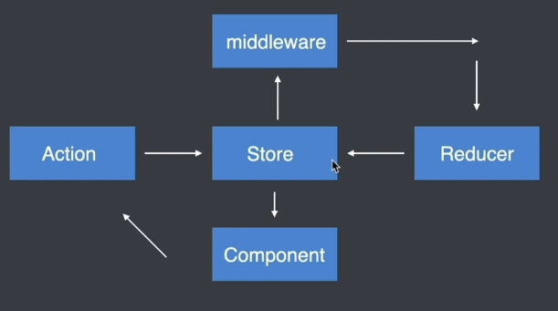

#### Redux 中间件
- 中间件允许我们扩展 redux 应用程序
- 中间件本质上就是一个函数:


#### Redux 加入了 中间件后的工作流程
-  组件触发 `action` 后, `store` 先将 `action` 交给 `中间件` 处理,然后再将 `action` 传递给 `reducer` 函数
  


- 模板代码
```js
export default store => next => action => { }
```